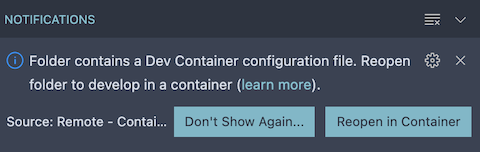

# Tyler Icons

This library contains SVG icons converted to JavaScript modules (with TypeScript typings) to allow for distributing a tree-shakable
icon library that can be imported into applications on a per-icon basis as needed.

## TCW usage

This package only contains SVG icons that are distributed as importable JavaScript constants. It's expected that you will use these
icons with the TCW `<tcw-icon>` component to easily render them. This means you can define each component with the TCW icon registry
to easily choose the icons that your application needs, the rest will be ignored and tree shaken away!

After installing the `@tylertech/tyler-icons` package into your project, you can then import and define the icons you want to use with
the registry.

> **Important:** the icons are separated out by the following directories in the package:
> * standard: The official Google Material icons.
> * extended: The community-based Material icons.
> * custom: Tyler-owned custom Material icons.
>
> Be sure to import icons from the corresponding directory within the package. See the [Forge icon library](https://forge.tylertech.com/core-components/iconography/library) for help finding icons.

```ts
import { tylIconAccountCircle, tylIconFace } from '@tylertech/tyler-icons/standard';
import { tylIconAccountDetails } from '@tylertech/tyler-icons/extended';
import { tylIconActionLauncher } from '@tylertech/tyler-icons/custom';
import { TylerIconRegistry } from '@tylertech/tyler-components-web';

TylerIconRegistry.define([tylIconAccountCircle, tylIconFace, tylIconAccountDetails, tylIconActionLauncher]);
```

 Now you can use this icon name with the `<tcw-icon>` component:

 ```html
 <tcw-icon name="face"></tcw-icon>
 ```

 You can also load icons dynamically (without registering them locally) by using the external CDN. Just set the `external` attribute to enable the component to make a request to the CDN to fetch the icon data dynamically (if not exists in the local registry):

 ```html
 <tcw-icon name="face" external external-type="standard"></tcw-icon>
 ```
 
 > Just be sure to specify the correct set name in the value of the `external-type` attribute. Valid values: "standard" (default), "extended", "custom".
 
 A property by the name of `externalUrlBuilder` exists on the component which can be set to a callback that will be executed when the component is creating the URL to fetch the icon from. This gives you control over hosting the icons yourself elsewhere from the public CDN if desired.

## Non-TCW usage

If you aren't using TCW, you will need to use a different means for rendering the icons from this package. Each icon is exported with its
name and the SVG structure as a `string`. You can then use that SVG content to convert to HTML manually.

## Missing an icon?

This is a Tyler-wide icon library, and we want to make sure we ease the lives of people using icons as well as share our icons in a common
format. If there is an icon missing, please submit an issue to get it added. We have third-party icons as well as custom Tyler owned icons
that are distributed through this library and we'd be happy to add any that are missing for your team!

## Development

### Developing inside a container

This project supports vscode DevContainers to help streamline and standardize the local development process. To get started with DevContainers you'll need to ensure you're running the following on your local machine:

- Docker
- Visual Studio Code
- VSCode Remote Development extension pack.

See these [getting-started](https://code.visualstudio.com/docs/remote/containers#_installation) instructions for additional details.

Once setup, VSCode should prompt with a notification that a DevContainer config file is recognized and suggest re-opening within a container.



To manually re-open the project within a dev container, simply open the VSCode Command Palette (`F1`) and select **Remote-Containers: Reopen Folder in Container**.

For more information on starting a development environment within a container see [Developing inside a Container](https://code.visualstudio.com/docs/remote/containers)

#### DevContainers Performance Notes

When opening this project in a DevContainer on a Windows or Mac operating system, you may experience poor disk performance due to their use of bind mounts. See the following article for additional information and tips on how you might [improve disk performance](https://code.visualstudio.com/remote/advancedcontainers/improve-performance).

#### Open in container
1. open project folder in vscode
1. open in container
1. wait for devcontainer to build (~5 minutes)
1. Serve the demo site to test the icons: `npm run start`
1. To build the npm package, run the following: `npm run build`


In situations where you're unable to make use of the WSL2 filesystem (Windows), or where you're using macOS, you'll experience the best performance by making use of the **Remote-Containers: Clone Repository in Container Volume** command within VSCode. See this [article](https://code.visualstudio.com/remote/advancedcontainers/improve-performance#_use-clone-repository-in-container-volume) for more information.

#### Clone in containers
1. open vscode
1. clone repository in container
1. wait for devcontainer to build (~5 minutes)
1. Serve the demo site to test the icons: `npm run start`
1. To build the npm package, run the following: `npm run build`


> note: if you make any package changes and want them to persist you may need to rebuild the container

### Build and Validate

To get started developing in this repository, follow these steps:

1. Install dependencies: `npm install`
2. Update any `.svg` in the `svg` directory (if applicable).
3. Serve the demo site to test the icons: `npm run start`
4. To build the npm package, run the following: `npm run build`

### Generating icon metadata

Icon metadata (JSON format) can also be generated from this repository:

```bash
npm run generate:metadata
```


> This is included in the CDN as well as the npm package.


